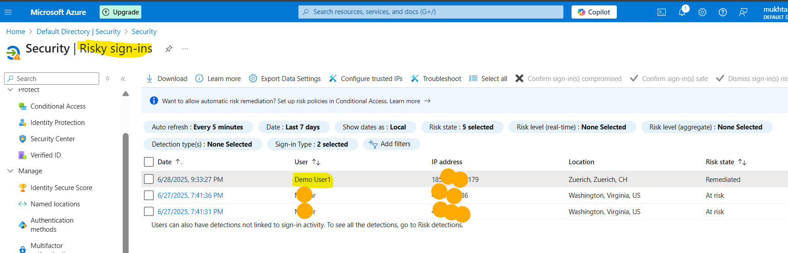

# Identity Hardening with Microsoft Entra ID

## Objective

Strengthen your Azure environment’s identity and access security using Microsoft Entra ID features, including:

- Conditional Access (CA)
- Privileged Identity Management (PIM)
- Secure group/user configurations

## Tools & Services Used

- Microsoft Entra ID
- Conditional Access Policies
- Privileged Identity Management (PIM)
- Azure Sign-In & Audit Logs
- MFA Configuration

## Lab Activities

###  Step 1: Create Security Group and Test Users

- Created `demo-user1` and `demo-user2`
- Group: `grp-security-testers`
- Added users to group

   Screenshot: `Screenshots/Step1-users-created.png`

---

###  Step 2: Configure and Test Conditional Access Policy

- Created CA policy: `MFA for Security Testers`
- Targeted `grp-security-testers` group
- Required MFA for Microsoft Azure Management
- Verified prompt using incognito session

   Screenshots:  
- `Screenshots/Step2-ca-policy-summary.png`  
- `Screenshots/Step2-mfa-prompt.png`

---

### Risky Sign-In Triggered and Detected (Demo User1)

- A sign-in from **Demo User1** triggered a **"risky sign-in"** event.
- Microsoft Entra flagged this based on sign-in behavior and simulated risk conditions.
- Verified that Conditional Access required MFA during this attempt.
- Reviewed alert under **Entra ID Protection > Risky sign-ins**.

 Screenshot:
- `Screenshots/Step2-risky-signin-demo-user1.png`

---
### Step 3: Role Assignment via Privileged Identity Management (PIM)

- Assigned `Security Administrator` role to `demo-user1`
- Made user **eligible** and activated via PIM
- Verified in PIM > My Roles

  Screenshots:  
- `Screenshots/Step4-role-assignment.png`  
- `Screenshots/Step4-pim-activation.png`

---

### Step 4: Log & Audit Review

- Reviewed **Sign-in Logs** and **Audit Logs**
- Validated role activations and MFA attempts

   Screenshots:  
- `Screenshots/Step5-signin-log.png`  
- `Screenshots/Step5-audit-log.png`

---

## Files Included

- `README.md`: This file
- `Report.md`: Summary of security findings
- `Screenshots/`: Step-based visual evidence

  ---
  ## Navigation

🔹 [⬅ Back to All Labs](../../README.md)  
🔹 [1 – Secure Azure Environment](../1-secure-azure-env/)  
🔹 [3 – Coming Soon](../3-governance-access-reviews/)  

---

## Author

**Muktar Mohamed**  
🔗 [Connect on LinkedIn](https://www.linkedin.com/in/muktarmohamed)

---

## Next Steps

- Explore Identity Governance (Access Reviews, Entitlement Management)
- Simulate leaked credentials scenarios
- Integrate Defender for Identity with Sentinel

---

## Summary

This lab demonstrates the core capabilities of Microsoft Entra ID for identity protection, least privilege access, and monitoring. These features are crucial for a modern cloud security posture.
