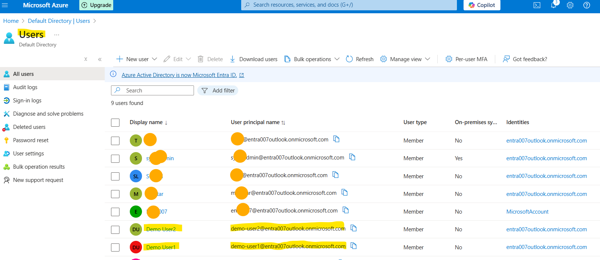
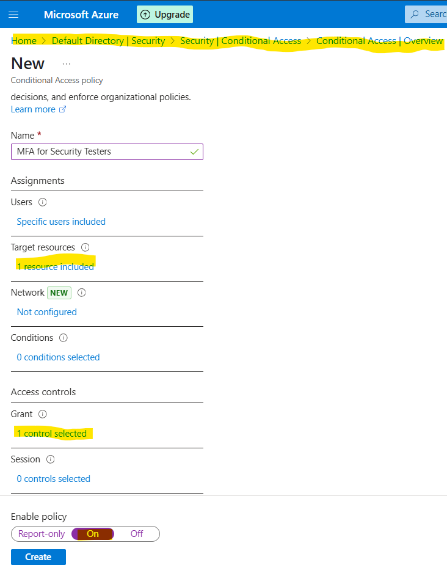
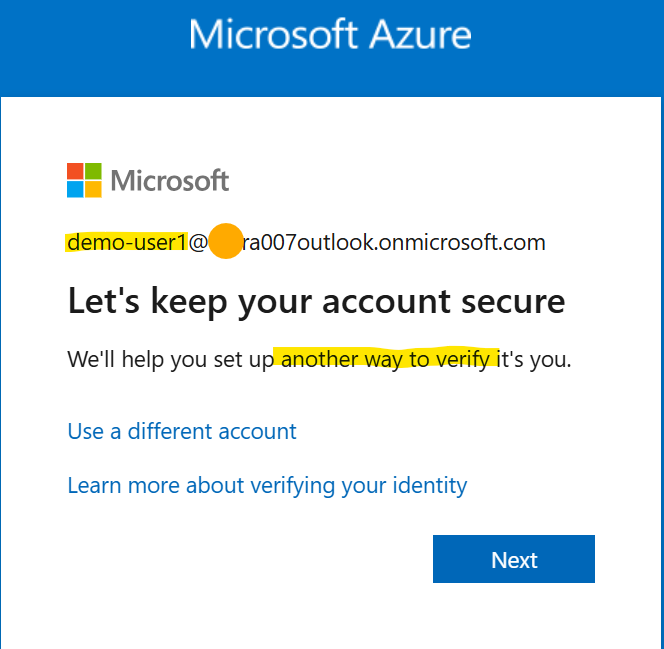
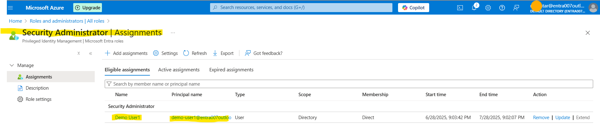
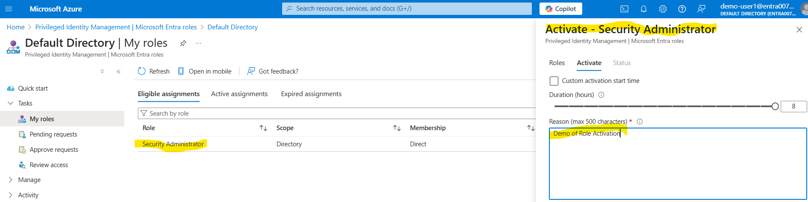

# Step-by-Step Identity Hardening Lab with Screenshots

A visual, hands-on walkthrough of Identity Hardening with Microsoft Entra ID. Screenshots are included to accompany each step.

---

## Step 1: Create Test Users and Security Group

1. Go to Microsoft Entra ID > Users > + New User
2. Create:
   - demo-user1 (standard user)
   - demo-user2 (standard user)
3. Assign temporary passwords and save them.
4. Navigate to Groups > + New Group
   - Group type: Security
   - Name: grp-security-testers
   - Add both test users as members.

**Screenshot:**  

---

## Step 2: Conditional Access Policy – Require MFA

1. Go to: Microsoft Entra ID > Protection > Conditional Access
2. Click + New Policy
3. Name it: MFA for Security Testers
4. Configure the following:
   - Users/Groups: grp-security-testers
   - Cloud Apps: Microsoft Admin Portals
   - Access Controls: Grant ➞ Require MFA
   - Enable Policy: On
5. Save and enable the policy.
6. Open an Incognito Browser and sign in as demo-user1 to test the MFA requirement.

**Screenshots:**  
- Conditional Access Policy Summary:  
  

- MFA Prompt (during test login):  
  

---

## Step 3: Role Assignment via PIM (Privileged Identity Management)

1. Go to: Microsoft Entra ID > Roles and Administrators
2. Search and select the role: Security Administrator
3. Click + Add Assignments
   - Select demo-user1
   - Assignment type: Eligible
4. Go to: Microsoft Entra ID > PIM > My Roles
5. Activate the role as demo-user1
   - Provide justification and choose activation time.

**Screenshots:**  
- Role Assignment Summary:  
  

- PIM Activation Confirmation:  
  

---

## Wrap-Up

- Test users and roles were created and tested successfully.
- Conditional Access enforced MFA for selected users.
- Role-based access was controlled and elevated using PIM.

Refer to `Report.md` for written analysis and observations.

Remember to clean up the test users, group, and role assignments when finished.

