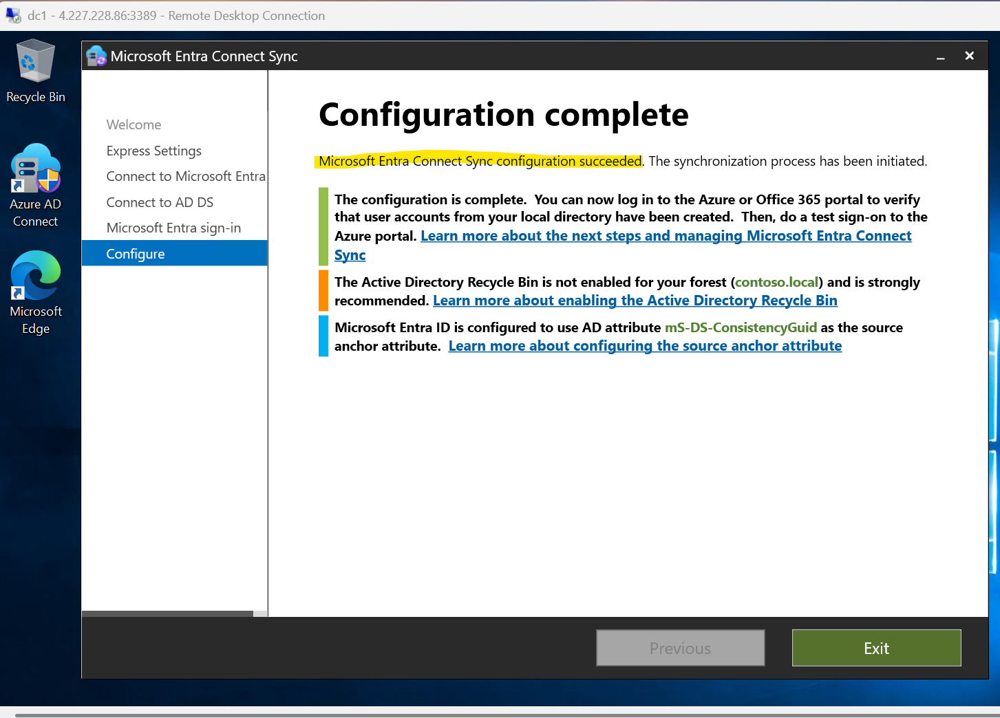

# Step-by-Step Lab Guide: Microsoft Entra ID Hybrid Identity Sync

This guide walks through synchronizing on-premises AD users with Microsoft Entra ID using Entra Connect Sync.

---

## 1. Build a Virtual Network

- Azure Portal → Virtual Networks → + Create
- Subnet: `Directory-subnet` (`10.1.1.0/24`)

---

## 2. Provision Windows Server 2019 VM

- VM Name: `DC1`
- Subnet: `Directory-subnet`

---

## 3. Install Active Directory Domain Services

- Open Server Manager → Add Roles → Select AD DS

---

## 4. Promote VM to Domain Controller

- Domain: `contoso.local`

---

## 5. Create Users and Groups

- Users: `ali`
- Groups: `CloudUsers`

---

## 6. Create OU and Move Users

- OU: `AAD-Sync`

---

## 7. Install Entra Connect Sync

- Download: https://aka.ms/EntraConnect

---

## 8. Configure Synchronization

- Use OU Filtering → Select `AAD-Sync`

---

## 9. Post-Configuration in Entra ID

- View synced users

---

*Lab Complete!*
